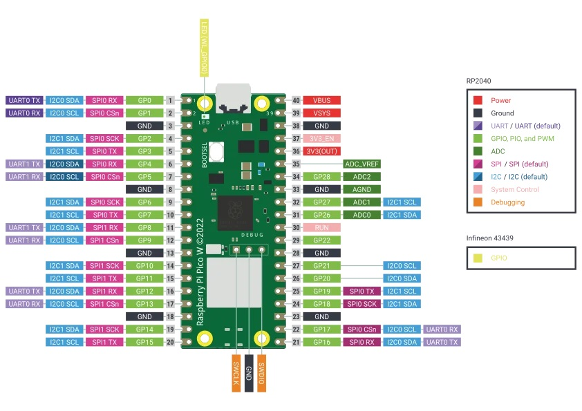

# Raspberry Pi Pico W Examples Repository with MicroPython

This repository contains example code in MicroPython for using the Raspberry Pi Pico W. The main focus of this repository is to demonstrate the usage of GPIO (General Purpose Input/Output) on the Raspberry Pi Pico W, as well as additional features such as timers, ADC (Analog-to-Digital Converter), and PWM (Pulse Width Modulation). It also includes examples of networking, such as HTTP requests and MQTT, and some encryption examples.

## Repository Contents

The repository is organized into the following sections:

1. **GPIO**: This section contains examples of how to use the GPIO on the Raspberry Pi Pico W as both inputs and outputs, including handling interrupts and reading/writing pins.

2. **Timers**: Here you'll find examples that demonstrate how to use timers on the Raspberry Pi Pico W to generate timed interrupts and perform tasks at specific intervals.

3. **ADC**: This section presents examples of how to use the Analog-to-Digital Converter (ADC) to read analog values from external sensors.

4. **PWM**: Here you'll find examples of how to use the PWM functionality to control the brightness of LEDs or other applications that require pulse width modulation.

5. **Networking**: This section contains examples of how to use the Raspberry Pi Pico W to perform HTTP requests and establish communication using the MQTT (Message Queuing Telemetry Transport) protocol.

6. **Encryption**: Here you'll find examples of how to use encryption techniques on the Raspberry Pi Pico W, such as symmetric and asymmetric encryption, to ensure the security of your data.

## Requirements

- A Raspberry Pi Pico W.
- MicroPython installed on the Raspberry Pi Pico W.
- Connection to a computer with support for the Raspberry Pi Pico W and a configured development environment.

## Contributions

Contributions to this repository are welcome! If you want to add new examples or improve existing ones, you can submit your changes through pull requests. Be sure to follow the established contribution guidelines.

## License

This repository is licensed under the [MIT License](LICENSE).

## Board

